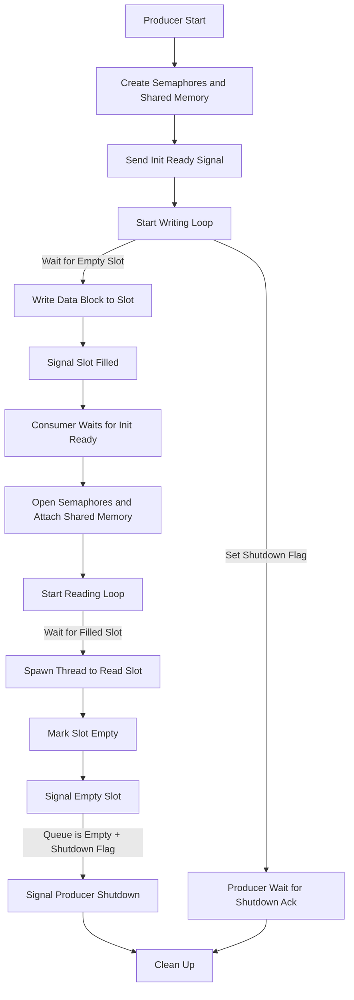
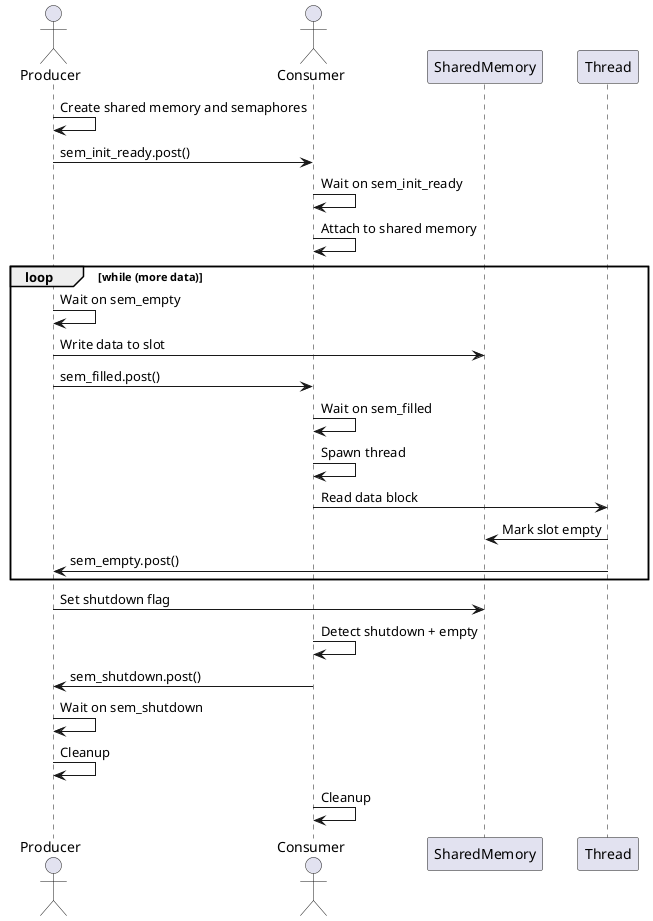

## 🧭 System Overview

The system consists of two independent processes that communicate via **shared memory** and coordinate access using **POSIX semaphores**.

* The **Producer** generates and writes large data blocks.
* The **Consumer** reads and processes these blocks concurrently.
* Synchronization ensures correct ordering and no data loss or overwriting.

---

## ✅ What the Application Does

1. **Initialization:**

   * Producer creates shared memory and semaphores.
   * Producer signals readiness via a semaphore (`sem_init_ready`).
   * Consumer waits until initialization is complete.

2. **Data Transfer Loop:**

   * Producer waits for an empty slot.
   * Producer writes 8MB data block to the slot.
   * Producer signals slot is filled.
   * Consumer waits for filled slot.
   * Consumer reads the data block in a thread.
   * Consumer marks the slot empty.

3. **Shutdown:**

   * After the final write, producer sets a shutdown flag.
   * Consumer reads remaining items and signals shutdown complete.
   * Both sides unlink semaphores and detach from shared memory.

---

## 🧩 Mermaid Diagram

---

## 🧬 PlantUML Sequence Diagram

